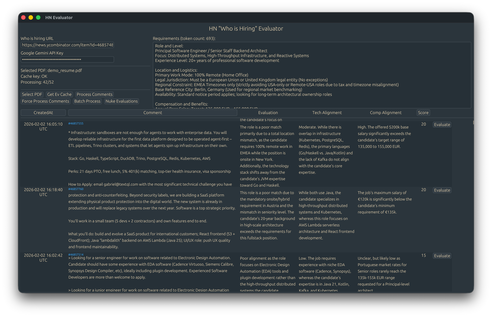

# HN's "Who is Hiring" Evaluator (Gemini only)



TL;DR; pass your preferences and your resume and get Gemini evaluate each "Who is Hiring" top comment.

## Installation/Run

Recommended (some extra info printed to console):

```
git clone https://github.com/exlee/hn-jobs-evaluator
cd hn-jobs-evaluator
cargo run
```

Or download binaries from [Releases](https://github.com/exlee/hn-jobs-evaluator/releases) page.


## Usage


1. Put "Who is Hiring" url  and Google's Gemini API Key
2. Press "Process Comments"  - it will download and cache comments ("force" button will drop cache)
3. Add PDF with Resume
4. Write your requirements (Important - resume and requirements need to have at least 1024 tokens in total)
5. Get Evaluation Cache 
6. Click Batch Process to start processing comments in bulk, or press "Evaluate" button next to each comment

## Alpha Notices

- It's a one-day-app so not quite polished
- Only works with Google's Gemini 3 Flash Preview
- ⚠️ **Cache Key expires after an hour and need to be regenerated - not indicated in UI** 
- Getting cache takes ~10s, there's no indicator about progress
- Getting evaluation takes ~10s, there's no indicator
- Comments and evaluation cache json files are polluting CWD
- Evaluation might fail because Gemini produces garbage, so don't expect Batch Process counter to fetch all in one try
- ⚠️ **Process Batch button is togglable, meaning that restarting process take 2 clicks**
- Requirements should include Compensation expectations as well as desired Tech stack - otherwise "intelligence" will fail
- ⚠️ Cache needs 1024 tokens in total (PDF) to be created

## Extra info
- Application saves the state in app's storage 
- Evaluation is attached to Comment ID so comments can be safely refreshed without losing evaluation data
- Requirements section is plain form, demo version is generated from LLM but feel free to write what you're searching for in plain text, just keeping in mind that along with PDF data should have 1024 tokens at least (for cache reasons)
- Score is on scale 0-100
