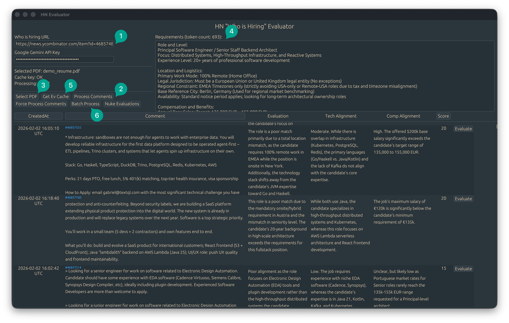

# HN "Who is Hiring" Evaluator (Gemini only)

Scanning the monthly HN hiring thread is tedious. This tool fetches all top-level comments, runs each one against your resume and requirements through Gemini, and scores them — so you read the 5 worth reading, not the 500.


## Installation

```bash
git clone https://github.com/exlee/hn-jobs-evaluator
cd hn-jobs-evaluator
cargo run
```

Or grab a binary from the [Releases](https://github.com/exlee/hn-jobs-evaluator/releases) page.

## Usage



1. Paste the "Who is Hiring" thread URL and your Gemini API key
2. Click **Process Comments** to fetch and cache the thread
3. Add your resume as PDF
4. Write your requirements (compensation, stack, location — be specific)
5. Click **Get Ev Cache** to upload context to Gemini
6. Click **Batch Process** to evaluate all comments, or **Evaluate** per row

## Known Limitations

- ⚠️ **Cost:** Evaluating a full monthly thread ran ~$40. Gemini Flash is the cheapest available option; costs scale with thread size and resume length.
- ⚠️ **Cache key expires after ~1 hour** — regenerate with "Get Ev Cache" if evaluations stop working
- ⚠️ **Batch Process is a toggle** — if you need to restart, click it twice
- ⚠️ **Resume + requirements must total at least 1024 tokens** — required by Gemini's caching API
- Gemini occasionally returns malformed output — Batch Process may not complete in one pass, just run it again
- No progress indicators yet; cache and evaluation both take ~10s
- Cache files are written to the working directory
- Only Gemini Flash is supported currently

## Notes

- State is persisted across sessions
- Evaluations are keyed to comment ID — safe to re-fetch the thread without losing results
- Scores are 0–100; each row shows Evaluation, Tech Alignment, and Comp Alignment separately
